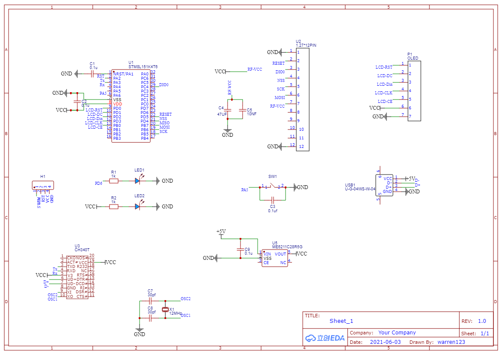
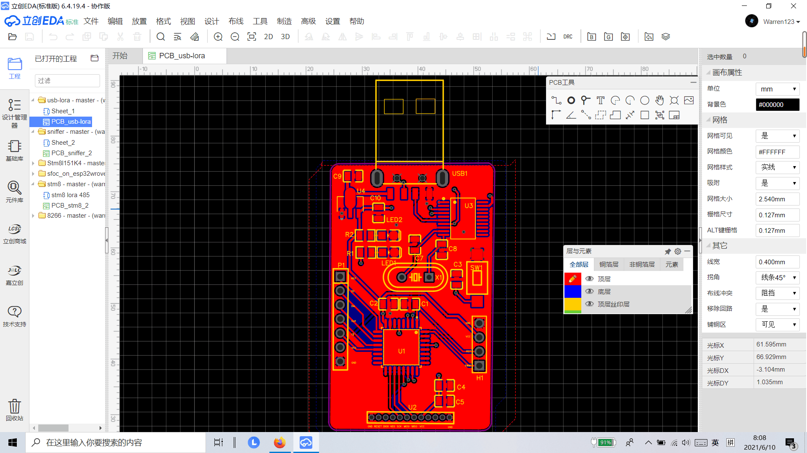

#Sniffer by STM8L and Lora
用于进行调试的工具

##sniffer有哪些功能？
 
* 可以进行Lora产品的调试
* 可以自动广播数据
* 可以通过串口来显示以及发送数据
* 带有OLED屏幕 可以显示数据内容和接受以及发送的数量

##问题反馈
个人项目 若有不足 欢迎指正
 

##项目展示
* 
* 
* 

##关于作者
* warren@伟
* E-mail:warren_wzw@163.com